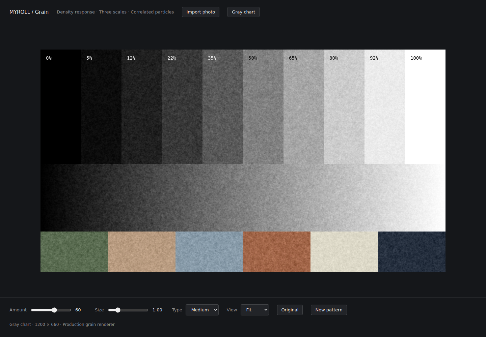

# Film grain model

The former shader changed sampling frequency with local brightness, floored
source coordinates, and used per-cell jitter for coarse noise. Size increased
frequency rather than particle diameter. Its random Perlin texture was rebuilt
for each processor, so the same still-image seed did not reproduce coarse grain
in a new preview or export renderer. Soft-light also changed the tone mean.

The replacement is a filtered stochastic approximation designed for interactive
WebGL2 editing. It is not a measured film-stock model or a Monte Carlo simulation
of silver-halide development.

## Density dependence

Let `Y` be the graded image's perceptual luminance and `p = 1 - Y` be an effective
developed-grain coverage proxy. Grain variance follows the Boolean-model-shaped
term `p(1-p)`. The amplitude response is:

```text
response = 2 sqrt(p(1-p)) (0.85 + 0.30p)
sigma = amount × 0.055 × response
```

The additional factor modestly favors shadows. Both black and white endpoints
remain clean. Density also changes the scale mixture smoothly, favoring larger
clumps in darker tones. It never moves grain coordinates, so a gradient or edge
cannot distort the particle field.

This is a perceptual density proxy after grading/LUTs, rather than a calibrated
optical-density or negative-to-scan transfer function. Stock-specific density
response would require measured material.

## Three scales

Every grain type contains independent fine, medium, and coarse fields with
coordinate scale factors `0.70`, `1.55`, and `3.40`. These factors are relative
correlation scales, rather than literal disk diameters. All divide source-image
coordinates by Size; a higher Size therefore produces larger particles.

| Type | Fine weight | Medium weight | Coarse weight |
| --- | ---: | ---: | ---: |
| Fine | 0.82 | 0.35 | 0.12 |
| Medium | 0.52 | 0.68 | 0.28 |
| Coarse | 0.30 | 0.55 | 0.78 |

Weights are normalized by their squared sum, including the density modifier.
This prevents mixing more layers from arbitrarily increasing grain strength.
Each scale has its own hash seed and rotation. A common luminance field supplies
most of the grain, with subtle color variation on colored pixels. Neutral and
black-and-white areas receive monochrome grain.

## Spatial correlation, tiling, and reduction

A fixed-seed, 256×256 RGBA8 atlas stores three independent Gaussian fields.
A periodic Gaussian filter (sigma 0.75 atlas texels) gives particles spatial
extent and makes the wrap boundary continuous. Each field is centered and
normalized. Stochastic texture offsets and smooth, variance-normalized tile
overlap prevent obvious repeated texture blocks without discontinuous jitter.

Nine mip levels are area-averaged from signed float fields. Quantization
residuals are balanced per channel, so each mip has exactly zero DC and the last
mip is neutral. Explicit texture gradients prevent random offsets from
corrupting LOD selection. A reduced preview integrates subpixel grain instead
of sampling a full-strength field above its Nyquist limit.

The shader uses twelve texture samples per grain pixel and one approximately
341 KiB texture, with a shared cached CPU atlas. Grain Amount = 0 skips the
grain shader block. Device-specific mobile GPU performance has not been
benchmarked.

## Tone and repeatability

Signed grain is added with a symmetric limiter using the available channel
headroom. This avoids soft-light's asymmetric tone shift and excessive clipping.
The seed, source UVs, and original image dimensions register the pattern across
preview and export renderers; reduced previews are filtered versions of that
pattern. The optional seed defaults consistently to 1.337. Stills ignore time;
the existing video path changes the grain seed at 24 frames per second.

Existing Amount / Size / Type settings and preset data remain compatible, but
the visual response of old saved settings changes with the new model.

## Validation

`npm test` checks field RMS/mean, independent channels, spatial covariance,
periodic edges, and mip variance/DC. `npm run test:grain` compiles and renders the
production shader and checks density response, black/white endpoints, neutral
color, scale spectra, Size direction, Amount response, deterministic new
processor instances, seed changes, and preview/export registration. It also
checks the comparison page's import, zoom, and narrow viewport behavior.



The recorded run used Chromium 131.0.6778.204 on Linux with SwiftShader WebGL2,
512×512 uniform inputs, Amount 0.8, Size 1, and seed 1.337:

| Type | Mean shift (8-bit values) | Grain RMS | Adjacent-pixel correlation |
| --- | ---: | ---: | ---: |
| Fine | 0.010 | 8.43 | 0.655 |
| Medium | -0.007 | 9.26 | 0.799 |
| Coarse | 0.029 | 9.55 | 0.906 |

For Medium, grain RMS was 5.17 at gray 20, 9.26 at gray 128, and 2.78 at gray
245; black and white had zero grain. A 128×128 preview of the 512×512 source
correlated 0.950 with a 4×4 area reduction of the full-resolution output. The
unit tests, WebGL checks, type check, and production build passed.

See [the full recorded results](grain-validation.json). These are software
WebGL results, not a mobile performance claim.

## Reference

Newson, Faraj, Galerne, and Delon, [Realistic Film Grain Rendering,
IPOL 2017](https://www.ipol.im/pub/art/2017/192/), motivates spatially correlated,
signal-dependent grain and filtered observation. This implementation uses its
statistical motivation; it does not reproduce the paper's Boolean-disk Monte
Carlo algorithm and contains no copied reference implementation.
